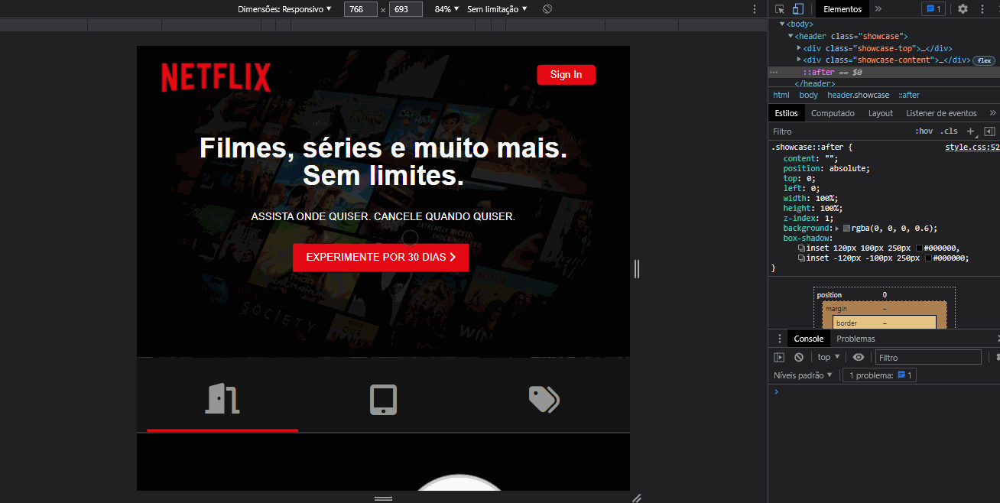

<h1 align="center">Clone Netflix</h1>
 
 

<h1>Desktop 🖥️ </h1>

  

<h1>Mobile 📱</h1>

  

<h1> Sobre 🔖</h1>

 Clone do site da netflix feito durante uma aula do programa de formação trade4devs da MaithaTech e TradeMaster

 

<h1> Tecnologias Utilizadas 🚀</h1>

<h3>
 • <a href="https://developer.mozilla.org/pt-BR/docs/Web/HTML">HTML</a>  
 • <a href="https://developer.mozilla.org/pt-BR/docs/Web/CSS">CSS</a>  
 • <a href="https://developer.mozilla.org/pt-BR/docs/Web/JavaScript">JS</a>  
 
</h3>

 

